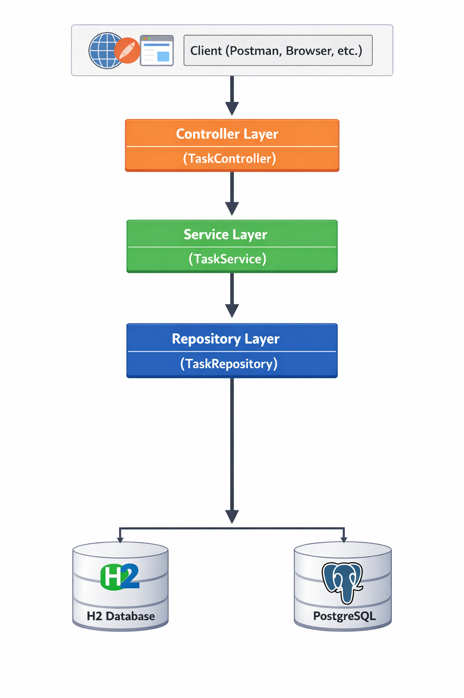

# 🗂 Task Management API – Spring Boot Backend Project

A RESTful Task Management API built using **Java Spring Boot** following clean layered architecture principles and industry-standard backend practices.

This project was implemented to gain hands-on experience with REST API design, database integration, DTO mapping, and structured backend development.

---

## 🎯 Project Goal

- Design and implement a RESTful backend service
- Apply layered architecture (Controller → Service → Repository)
- Separate domain models from API contracts using DTOs
- Integrate relational database using JPA/Hibernate
- Follow clean code and maintainable project structure

---

## 🚀 Features

- Create a task
- Retrieve all tasks
- Retrieve a task by ID
- Update a task
- Delete a task
- DTO ↔ Entity mapping using a dedicated Mapper layer
- Database persistence

---

## 🏗 Architecture

This project follows a **Layered Architecture** with clear separation of concerns:

```
Controller → Service → Mapper → Repository → Database
```

### 1️⃣ Controller Layer
- Handles HTTP requests
- Uses `@RestController`
- Maps endpoints with `@GetMapping`, `@PostMapping`, `@PutMapping`, `@DeleteMapping`
- Accepts/returns DTOs instead of entities

### 2️⃣ Service Layer
- Contains business logic
- Coordinates between controller, mapper, and repository
- Uses constructor-based dependency injection

### 3️⃣ Mapper Layer
- Converts between DTOs and Entities
- Prevents exposing internal entity models to API consumers
- Improves separation between persistence layer and API layer

### 4️⃣ Repository Layer
- Extends `JpaRepository`
- Provides CRUD operations
- Abstracts database communication

### 5️⃣ Database Layer
- H2 (development)
- PostgreSQL (production-ready configuration)

---

## 🛠 Technologies Used

- Java 17+ (Java 25)
- Spring Boot
- Spring Web
- Spring Data JPA
- Hibernate
- H2 Database
- PostgreSQL
- Maven
- REST APIs
- JSON

---

## 📚 Key Concepts Applied

### ✅ Spring Boot
- Auto-configuration
- Dependency Injection
- Bean lifecycle
- Configuration management

### ✅ RESTful API Design
- Proper HTTP method usage
- Status codes
- Resource-based routing
- JSON serialization/deserialization

### ✅ DTO Pattern
- Separation of API contract and domain model
- Improved maintainability
- Better control over exposed fields

### ✅ JPA & Hibernate
- Entity mapping with `@Entity`
- Primary keys using `@Id`
- Automatic schema generation
- Repository abstraction

### ✅ Clean Architecture Principles
- Separation of concerns
- Layer isolation
- Constructor injection
- Clear package organization

---

## 📌 Implementation Overview

### Step 1 – Project Setup
- Initialized Spring Boot project with Maven
- Added Web and JPA dependencies
- Configured database in `application.properties`

### Step 2 – Domain Modeling
- Created Task entity
- Defined persistence annotations
- Configured ID generation strategy

### Step 3 – DTO & Mapper Layer
- Created TaskDTO
- Implemented Mapper to convert:
    - DTO → Entity
    - Entity → DTO
- Ensured API does not expose internal entity structure

### Step 4 – Repository Layer
- Implemented interface extending `JpaRepository`
- Leveraged built-in CRUD operations

### Step 5 – Service Layer
- Implemented business logic
- Integrated mapper and repository
- Handled entity lookup and update logic

### Step 6 – REST Controller
- Exposed REST endpoints
- Used DTOs in request/response bodies
- Returned proper HTTP status codes

### Step 7 – Database Integration & Testing
- Tested using H2/PostgreSQL
- Verified persistence behavior
- Tested endpoints using Postman

---

## 📡 API Endpoints

| Method | Endpoint        | Description        |
|--------|----------------|-------------------|
| GET    | `/tasks`        | Get all tasks     |
| GET    | `/tasks/{id}`   | Get task by ID    |
| POST   | `/tasks`        | Create new task   |
| PUT    | `/tasks/{id}`   | Update task       |
| DELETE | `/tasks/{id}`   | Delete task       |

---

## 🖼 Project Structure

Below is the project structure and layered design:



Example package structure:

```
com.amingharibi.taskapp
│
├── controller
│   └── GlobalExceptionHandler
│   └── TaskController
│
├── service
│   └── impl
│         └── TaskServiceImpl
│   └── TaskService
│
├── mapper
│   └── impl
│         └── TaskMapperImpl
│   └── TaskMapper
│
├── repository
│   └── TaskRepository
│
├── domain
│   └── dto
│         └── CreateTaskRequestDto
│         └── ErrorDto
│         └── TaskDto
│         └── UpdateTaskRequestDto
│   └── Entity
│         └── Task
│         └── TaskPriority
│         └── TaskStatus
│   └── CreateTaskRequest
│   └── UptadeTaskRequest
│
│
└── exception
│   └── TaskNotFoundException
```

---

## ▶️ How to Run

```bash
git clone https://github.com/M-AminGharibi/Task-Tracker-Java-Spring-Boot
cd Task-Tracker-Java-Spring-Boot
./mvnw spring-boot:run
```

Application runs on:

```
http://localhost:8080
```

---

## 🔮 Future Improvements

- Global exception handling using `@ControllerAdvice`
- Input validation using `@Valid`
- Pagination and sorting
- Unit and integration testing
- Spring Security + JWT authentication
- Docker containerization
- CI/CD integration
